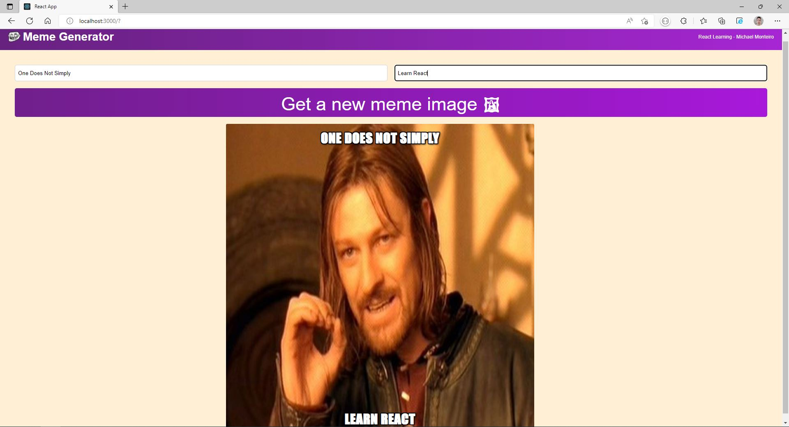

# Meme-Generator-React
Learning more React by Creating a Meme Generator!<br>
We want to make a website that fetches the 100 most current popular memes of the time and when we click the button it will randomly generate a Meme image that the visitor of the site than can alter to change the text on this Meme!

<br>

### Step 1:
First lets start by making a Header/Navbar Component for our little meme generator. 


```js
export default function Header() {
    return (
        <header className="header">
            
            <h2 className="header--title">Meme Generator</h2>
            <h4 className="header--project">React Learning - Michael Monteiro</h4>
        </header>
    )
}
```

<br>


### Step 2:
Making the form layout and add some styling to the page.


```js
export default function Meme(){
    return(
        <main>
            <form className="form">
                <input
                    type="text"
                    placeholder="Top Text"
                    className="form--input"
                />
                <input
                    type="text"
                    placeholder="Bottom Text"
                    className="form--input"
                />
                <button className="form--button">Get a new meme image 🖼</button>
            </form>
        </main>
    )
}
```

### Step 3:
Let's make a fetch to the API https://api.imgflip.com/get_memes and render it on our page.
We useState to setAllmemes from the fetch, with the setMeme state we can adjust the text showing in top and bottom on the meme. 
We make a function getMemeImage to get a random image and a handleChange event to setMeme.
```js
export default function Meme(){

    const [meme, setMeme ] = useState({
        topText: "",
        BottomText: "",
        randomImage: "https://i.imgflip.com/1bij.jpg"
    })

    const [allMemes, setAllmemes] = useState([]);


    useEffect(() => {
        fetch(`https://api.imgflip.com/get_memes`)
            .then((response) => response.json())
            .then((data) => setAllmemes(data.data.memes));
    }, []);

    function getMemeImage() {
        const randomNumber = Math.floor(Math.random() * allMemes.length)
        const url = allMemes[randomNumber].url
        setMeme(prevMeme => ({
            ...prevMeme,
            randomImage: url
        }))

    }

    function handleChange(event) {
        const {name, value} = event.target
        setMeme(prevMeme => ({
            ...prevMeme,
            [name]: value
        }))
    }


    return (
        <main>
            <div className="form">
                <input
                    type="text"
                    placeholder="Top text"
                    className="form--input"
                    name="topText"
                    value={meme.topText}
                    onChange={handleChange}
                />
                <input
                    type="text"
                    placeholder="Bottom text"
                    className="form--input"
                    name="bottomText"
                    value={meme.bottomText}
                    onChange={handleChange}
                />
                <button
                    className="form--button"
                    onClick={getMemeImage}
                >
                    Get a new meme image 🖼
                </button>
            </div>
            <div className="meme">
                
                <h2 className="meme--text top">{meme.topText}</h2>
                <h2 className="meme--text bottom">{meme.bottomText}</h2>
            </div>
        </main>
    )
}
```

So learning this Project I Learned once more about how to fetch data and render it. 
Also learned about useState and useEffect once more!
Now go and generate some Memes!!!

