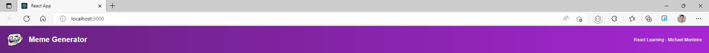
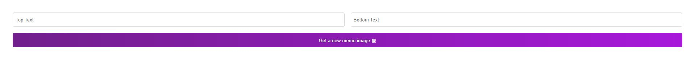

# Meme-Generator-React
Learning more React by Creating a Meme Generator!<br>
We want to make a website that fetches the 100 most current popular memes of the time and when we click the button it will randomly generate a Meme image that the visitor of the site than can alter to change the text on this Meme!

<br>

### Step 1:
First lets start by making a Header/Navbar Component for our little meme generator. 



```js
export default function Header() {
    return (
        <header className="header">
            
            <h2 className="header--title">Meme Generator</h2>
            <h4 className="header--project">React Learning - Michael Monteiro</h4>
        </header>
    )
}
```

<br>


### Step 2:
Making the form layout and add some styling to the page.


```js
export default function Meme(){
    return(
        <main>
            <form className="form">
                <input
                    type="text"
                    placeholder="Top Text"
                    className="form--input"
                />
                <input
                    type="text"
                    placeholder="Bottom Text"
                    className="form--input"
                />
                <button className="form--button">Get a new meme image 🖼</button>
            </form>
        </main>
    )
}
```